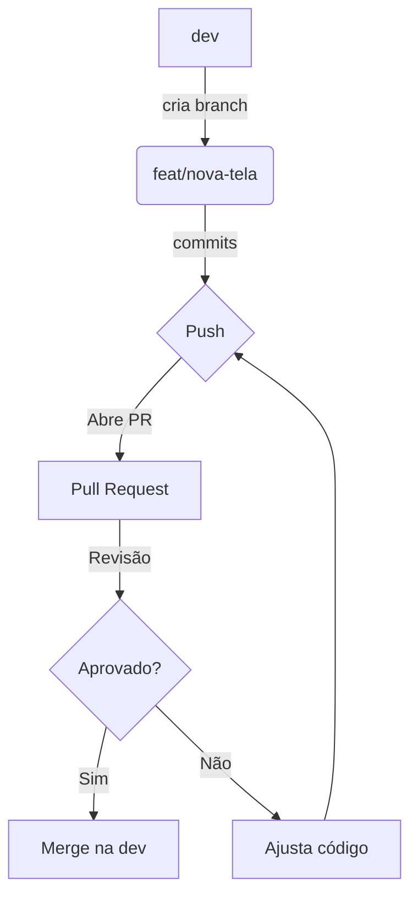

# Welcome to your Expo app 👋

This is an [Expo](https://expo.dev) project created with [`create-expo-app`](https://www.npmjs.com/package/create-expo-app).

## Get started

1. Install dependencies

   ```bash
   npm install
   ```

2. Start the app

   ```bash
   npx expo start
   ```

In the output, you'll find options to open the app in a

- [development build](https://docs.expo.dev/develop/development-builds/introduction/)
- [Android emulator](https://docs.expo.dev/workflow/android-studio-emulator/)
- [iOS simulator](https://docs.expo.dev/workflow/ios-simulator/)
- [Expo Go](https://expo.dev/go), a limited sandbox for trying out app development with Expo

You can start developing by editing the files inside the **app** directory. This project uses [file-based routing](https://docs.expo.dev/router/introduction).

## Get a fresh project

When you're ready, run:

```bash
npm run reset-project
```

This command will move the starter code to the **app-example** directory and create a blank **app** directory where you can start developing.

## Git & Commit Convention 🚀

Este projeto utiliza **Git** para controle de versão e segue uma convenção de commits para manter o histórico limpo e compreensível.

### Tipos de commit:

- `feat`: Nova funcionalidade
- `fix`: Correção de bug
- `refactor`: Refatoração de código (melhoria sem alterar funcionalidade)
- `docs`: Alterações na documentação
- `style`: Formatação, sem alteração de código (espaços, ponto e vírgula, etc)
- `test`: Adição ou ajuste de testes
- `chore`: Tarefas de manutenção (build, dependências, etc)

### Exemplos de mensagens de commit:

```bash
feat: tela de login com autenticação
fix: corrigir bug no fluxo de logout
refactor: extrair componente Header
```

### Fluxo de Branch e Pull Request

1. Sempre crie uma branch a partir da `dev`:
   ```bash
   git checkout dev
   git pull origin dev
   git checkout -b feat/nome-da-feature
   ```
2. Faça commits pequenos e frequentes.
3. Ao terminar, suba sua branch:
   ```bash
   git push origin feat/nome-da-feature
   ```
4. Abra um Pull Request (PR) para a branch `dev` no GitHub.
5. Aguarde revisão e aprovação do PR.
6. Após aprovação, faça o merge do PR na `dev`.

#### Exemplo de fluxo visual (Mermaid):



### Dicas para usar o Git:

- Sempre crie uma branch para cada feature ou correção.
- Faça commits pequenos e frequentes.
- Use mensagens claras e objetivas seguindo a convenção acima.
- Antes de abrir um Pull Request, garanta que está na branch correta e que o código está testado.

## Learn more

To learn more about developing your project with Expo, look at the following resources:

- [Expo documentation](https://docs.expo.dev/): Learn fundamentals, or go into advanced topics with our [guides](https://docs.expo.dev/guides).
- [Learn Expo tutorial](https://docs.expo.dev/tutorial/introduction/): Follow a step-by-step tutorial where you'll create a project that runs on Android, iOS, and the web.

## Join the community

Join our community of developers creating universal apps.

- [Expo on GitHub](https://github.com/expo/expo): View our open source platform and contribute.
- [Discord community](https://chat.expo.dev): Chat with Expo users and ask questions.

# app_itel
